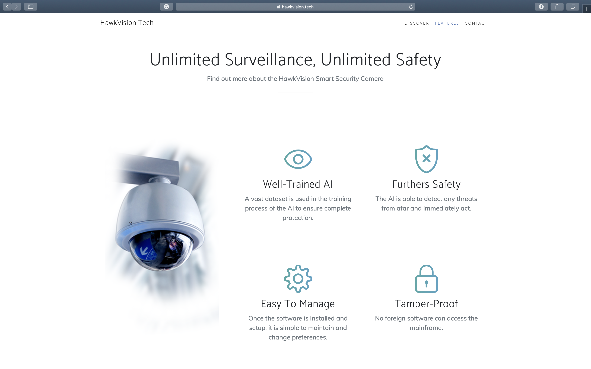
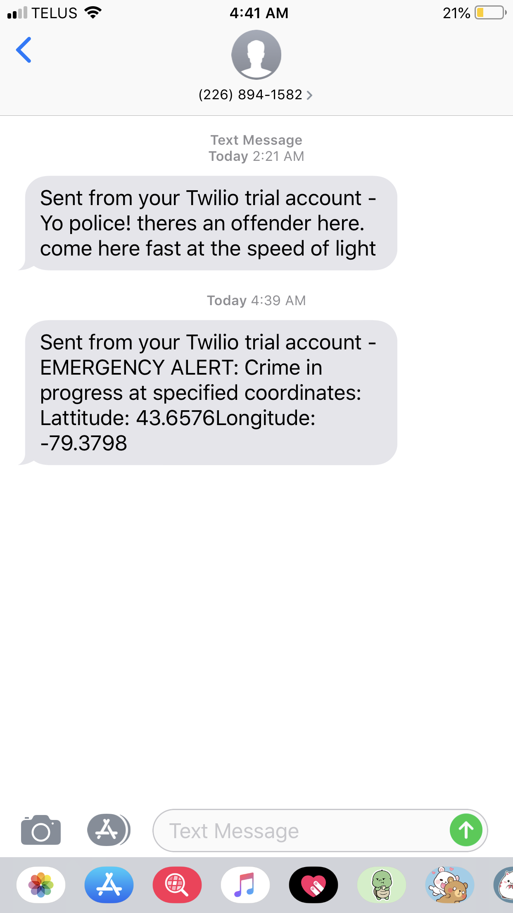

# HackVision Tech

## Inspiration
A highly unfortunate fact remains that criminals can remain free due to crimes being undetected, slow response times, and victims held at gunpoint and unable to alert the authorities, proving a need to right these wrongs and stop these crimes before they progress too far. 

## What it does
It is a threat detection algorithm that has enhanced security integrated within the smart surveillance systems that can detect any threat (handheld weaponry) and suspicious behaviours from afar.

* Implementation of state of the art object detection and classification algorithms
* Artificially Intelligent system providing enhanced security integrated within the surveillance systems
* Smart threat and suspicious behaviour detection
* Detection support for situations like pre-initiation of a mass shooting and bank robberies or street muggings
* Removes the need for humans to keep track of security manually
* Reduces the action time by immediately alerting the police and security authorities

## Implementations
### Detection
 
### Website
 
### Emergency Notifications

## How we built it
* Azure virtual machine to train Machine Learning models and speed up the process using GPUs
* Azure's cognitive services API for image classification and object detection
* Python as backend
* Bootstrap and JavaScript on the frontend

## Contributors
* [Alicia Tran](https://github.com/alicia4550)
* [Marina Semenova](https://github.com/marinasemen0va)
* [Raghav Kharbanda](https://github.com/kharbandaraghu)
* [Michelle Ma](https://github.com/mishymelody)

## Link to website
[HawkVision AI](https://hawkvision.tech/)

## License
[MIT](https://choosealicense.com/licenses/mit/)
